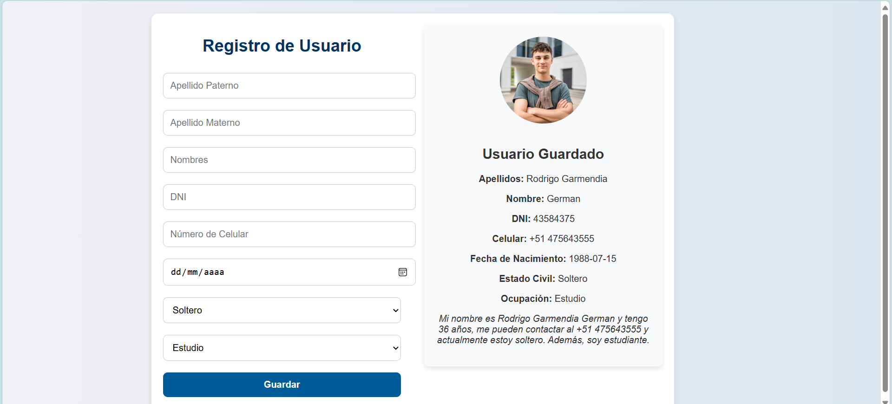

# Sistema de Registro de Usuario



## Descripción General

Este proyecto consiste en una aplicación web para el registro de usuarios, desarrollada con un backend en **FastAPI** (Python) y un frontend en **React** (JavaScript). La aplicación permite ingresar datos personales de un usuario, que se almacenan en una base de datos **SQLite**. Luego, los datos se muestran en una interfaz amigable y organizada, con un formato específico para la ocupación del usuario, diferenciando entre estudiante y trabajador.

## Requisitos Previos

Antes de comenzar, asegúrate de tener instalados los siguientes programas:

1. **Node.js** y **npm** (Node Package Manager) para ejecutar y gestionar el frontend.
2. **Python 3** para ejecutar el backend.
3. (Opcional) **SQLite Viewer Free** u otra extensión similar en **VS Code** para observar la base de datos.

## Estructura del Proyecto

```plaintext
proyecto-usuario/
├── backend/
│   ├── main.py                 # Archivo principal de FastAPI (backend)
│   ├── models.py               # Modelos de datos y definición de la base de datos
│   ├── schemas.py              # Esquemas de Pydantic para validación de datos
│   ├── database.py             # Configuración de la base de datos SQLite
│   ├── crud.py                 # Operaciones de CRUD (Create, Read, Update, Delete)
│   └── requirements.txt        # Dependencias de Python
├── frontend/
│   ├── public/
│   ├── src/
│   │   ├── components/
│   │   │   ├── Form.js         # Componente de formulario de usuario
│   │   │   └── App.js          # Componente principal de la aplicación
│   │   ├── services/
│   │   │   └── api.js          # Archivo para peticiones HTTP al backend
│   │   ├── App.css             # Estilos CSS para la interfaz
│   │   └── index.js            # Punto de entrada de React
│   └── package.json            # Dependencias de React
├── .gitignore
└── README.md                   # Documentación del proyecto
```

## Instalación

1. **Clona el repositorio** en tu máquina local:
   ```bash
   git clone <URL-del-repositorio>
   cd proyecto-usuario
   ```

2. **Instala las dependencias del backend**:
   - Navega a la carpeta `backend`:
     ```bash
     cd backend
     ```
   - Instala las dependencias de Python especificadas en `requirements.txt`:
     ```bash
     pip install -r requirements.txt
     ```

3. **Instala las dependencias del frontend**:
   - Navega a la carpeta `frontend`:
     ```bash
     cd ../frontend
     ```
   - Instala las dependencias de Node.js especificadas en `package.json`:
     ```bash
     npm install
     ```

## Ejecución del Proyecto

Para ejecutar el proyecto, abre dos terminales: una para el backend y otra para el frontend.

### Ejecución del Backend

1. En una terminal, asegúrate de estar en la carpeta `backend`:
   ```bash
   cd backend
   ```
2. Ejecuta el siguiente comando para iniciar el servidor FastAPI:
   ```bash
   PYTHONPATH=.. uvicorn backend.main:app --reload
   ```
3. El backend se ejecutará en `http://127.0.0.1:8000`, donde puedes acceder a la documentación interactiva generada automáticamente en `http://127.0.0.1:8000/docs`.

### Ejecución del Frontend

1. En otra terminal, navega a la carpeta `frontend`:
   ```bash
   cd frontend
   ```
2. Ejecuta el siguiente comando para iniciar la aplicación React:
   ```bash
   npm start
   ```
3. El frontend se ejecutará en `http://localhost:3000`. Abre este enlace en tu navegador para ver la aplicación.

## Funcionamiento y Uso

1. En la interfaz de `http://localhost:3000`, completa el formulario de registro de usuario.
2. Ingresa datos como el apellido paterno, apellido materno, nombre, DNI, número de celular, fecha de nacimiento, estado civil y ocupación.
3. Al hacer clic en "Guardar", los datos se enviarán al backend para ser almacenados en la base de datos SQLite.
4. Después del registro, los datos del usuario se mostrarán en el panel derecho de la interfaz, junto con una frase específica que refleja si el usuario es estudiante o trabajador.

## Base de Datos

Todos los datos de usuario se almacenan en una base de datos **SQLite** ubicada en la carpeta `backend`. Puedes revisar los datos almacenados usando la extensión **SQLite Viewer Free** en VS Code:

1. En VS Code, instala la extensión "SQLite Viewer Free".
2. Abre el archivo de base de datos (`usuarios.db`) en la carpeta `backend`.
3. Explora la tabla `usuarios` para ver los datos almacenados.

## Explicación Detallada de los Archivos

### Backend

- **main.py**: Inicia el servidor de FastAPI y define las rutas principales para el manejo de usuarios.
- **models.py**: Define los modelos de datos y la estructura de la tabla `usuarios` en la base de datos SQLite.
- **schemas.py**: Define los esquemas de datos usando Pydantic, que se encargan de la validación de datos.
- **database.py**: Configura la conexión a la base de datos SQLite.
- **crud.py**: Contiene las funciones de CRUD para manejar las operaciones de creación, lectura, actualización y eliminación en la base de datos.
- **requirements.txt**: Lista de dependencias de Python necesarias para ejecutar el backend.

### Frontend

- **components/Form.js**: Componente principal que maneja el formulario de registro de usuario y la lógica de envío de datos.
- **components/App.js**: Componente de entrada de la aplicación que envuelve el formulario.
- **services/api.js**: Contiene las configuraciones para hacer peticiones HTTP al backend usando Axios.
- **App.css**: Archivo de estilo para el frontend, donde se definen los estilos CSS para la interfaz.
- **index.js**: Punto de entrada de la aplicación React, que renderiza los componentes en el navegador.
- **package.json**: Lista de dependencias y scripts de npm para ejecutar el frontend.

## Resumen de Puertos

- **Backend**: `http://127.0.0.1:8000`
- **Frontend**: `http://localhost:3000`

Claro, a continuación se añaden las condiciones necesarias para que los datos ingresados en el formulario sean válidos. Estas condiciones se deben documentar en la sección de "Validación de Datos" dentro de la documentación.

---

## Validación de Datos

Para que los datos ingresados en el formulario sean válidos, deben cumplir con las siguientes condiciones:

1. **Apellido Paterno**:
   - Campo obligatorio.
   - No debe estar vacío.

2. **Apellido Materno**:
   - Campo obligatorio.
   - No debe estar vacío.

3. **Nombres**:
   - Campo obligatorio.
   - No debe estar vacío.

4. **DNI**:
   - Campo obligatorio.
   - Debe contener exactamente 8 dígitos numéricos (solo números).
   - Ejemplo válido: `12345678`

5. **Número de Celular**:
   - Campo obligatorio.
   - Debe comenzar con el prefijo `+51` y estar seguido por exactamente 9 dígitos numéricos.
   - Ejemplo válido: `+51987654321`
   - Ejemplos inválidos:
     - `987654321` (falta el prefijo `+51`)
     - `+512345678` (menos de 9 dígitos después de `+51`)
     - `+519876543210` (más de 9 dígitos después de `+51`)

6. **Fecha de Nacimiento**:
   - Campo obligatorio.
   - Debe ser una fecha válida en el formato `dd/mm/aaaa`.
   - No se permite una fecha futura; la fecha debe ser anterior o igual a la fecha actual.

7. **Estado Civil**:
   - Campo obligatorio.
   - Elige entre una de las opciones predefinidas: `Soltero`, `Casado`, `Divorciado`, `Viudo`.

8. **Ocupación**:
   - Campo obligatorio.
   - Elige entre una de las opciones predefinidas: `Estudio` o `Trabajo`.

---

## Conclusión

Este proyecto es una aplicación web completa para el registro de usuarios, desarrollada con FastAPI y React, y con una base de datos SQLite. Sigue las instrucciones anteriores para instalar, ejecutar y utilizar la aplicación. Puedes ver y gestionar los datos almacenados usando herramientas como SQLite Viewer Free.


